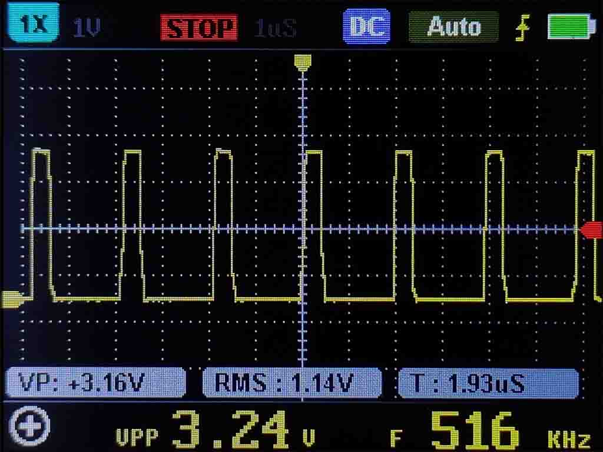
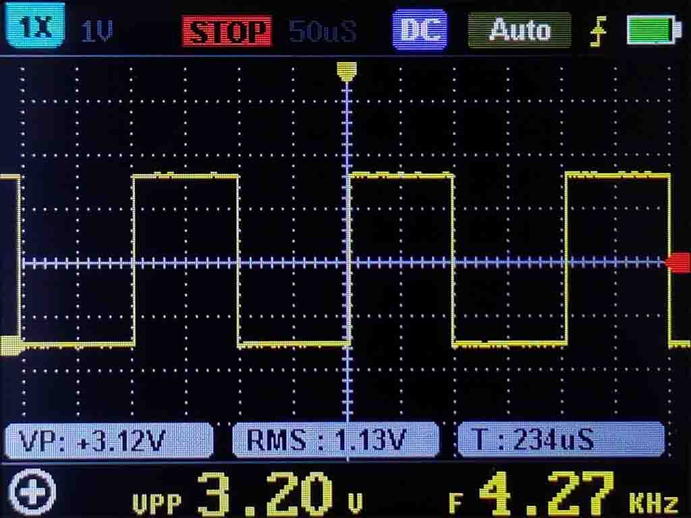

# Rockchip GPIO Driver for .NET

This project contains a **full function(PULL-UP, PULL-DOWN)** generic GPIO driver `RockchipDriver` for Rockchip SoCs and some special GPIO drivers like `OrangePi4Driver`, `NanoPiR2sDriver`.

## Getting started

### Generic GPIO driver: `RockchipDriver`

```C#
// Beacuse this is a generic driver, the pin scheme can only be Logical.
// The base addresses can be found in the corresponding SoC datasheet.
using GpioController gpio = new GpioController(PinNumberingScheme.Logical, new RockchipDriver(gpioRegisterAddresses: new uint[] { 0xFF72_0000, 0xFF73_0000, 0xFF78_0000, 0xFF78_8000, 0xFF79_0000 });

// Convert pin number to logical scheme.
int pinNumber = RockchipDriver.MapPinNumber(gpioNumber: 4, port: 'C', portNumber: 6);
// Open the GPIO pin.
gpio.OpenPin(pinNumber);
// Set the pin mode.
gpio.SetPinMode(pinNumber, PinMode.InputPullUp);
// Read current value of the pin.
PinValue value = gpio.Read(pinNumber);
```

### Special GPIO driver: `OrangePi4Driver`

```C#
using GpioController gpio = new GpioController(PinNumberingScheme.Board, new OrangePi4Driver());

gpio.OpenPin(7);
gpio.SetPinMode(7, PinMode.Output);
// Write a value to the pin.
gpio.Write(7, PinValue.High);
```

## Benchmark

Benchmarking with Orange Pi 4. The operating system is Armbian, Linux kernel version is 5.10.16, and .NET version is 5.0.3. The test uses different GPIO drivers to quickly switch the state of GPIO 150 (Logical), and uses an oscilloscope to measure the average frequency of GPIO externally.

| Drivers | Library Version | Average Frequency |  |
| :-: | :-: | :-: | :-: |
| RockchipDrivers | - | 426 KHz |  |
| SysFsDrivers | System.Device.Gpio 1.3.0 | 3.99 KHz |  |
| LibGpiodDrivers | System.Device.Gpio 1.3.0 <br/> libgpiod 1.2-3 | Unable to test due to segment fault | - |

## Adding new drivers

### For SoCs

1. Inheriting `RockchipDriver` Class.
    ```C#
    public class Rk3328Driver : RockchipDriver { }
    ```
2. Overriding the GPIO register addresses and adding GRF, CRU addresses.
    ```C#
    protected override uint[] GpioRegisterAddresses => new[] { 0xFF21_0000, 0xFF22_0000, 0xFF23_0000, 0xFF24_8000 };
    protected uint GeneralRegisterFiles => 0xFF10_0000;
    protected uint ClockResetUnit => 0xFF44_0000;        
    ```
3. Overriding `SetPinMode` method.
    ```C#
    protected override void SetPinMode(int pinNumber, PinMode mode)
    {
        // TODO
        // You can refer to the corresponding datasheet.
        // Clock & Reset Unit (CRU) chapter is used to enable the GPIO function.
        // General Register Files (GRF) chapter is used to set pin pull up/down mode.
        // GPIO chapter is used to set pin direction and level.
    }
    ```

### For Boards

1. Inherit the corresponding SoC class.
    ```C#
    // For NanoPi R2S
    public class NanoPiR2sDriver : Rk3328Driver { }
    ```
2. Overriding the mapping method for converting a board pin number to the driver's logical numbering scheme.
    ```C#
    // Mapping from board pins to logic pins.
    private static readonly int[] _pinNumberConverter = new int[]
    {
        -1, -1, -1,  MapPinNumber(2, 'D', 1), -1, MapPinNumber(2, 'D', 0), -1,
        MapPinNumber(2, 'A', 2), MapPinNumber(3, 'A', 4), -1, MapPinNumber(3, 'A', 6)
    };

    protected override int PinCount => _pinNumberConverter.Count(n => n != -1);

    protected internal override int ConvertPinNumberToLogicalNumberingScheme(int pinNumber)
    {
        int num = _pinNumberConverter[pinNumber];
        return num != -1 ? num : 
            throw new ArgumentException($"Board (header) pin {pinNumber} is not a GPIO pin on the {GetType().Name} device.", nameof(pinNumber));
    }
    ```

## References

Rockchip open source documents: http://opensource.rock-chips.com/wiki_Main_Page

## Samples

### Hardware required

* Orange Pi 4
* Switch
* Male/Female Jumper Wires

### Circuit


* Switch 1 - Board Pin7
* Switch 2 - GND

### Run the sample
```
cd RockchipGpioDriver.Samples
dotnet publish -c release -r linux-arm64 -o YOUR_FOLDER
sudo dotnet YOUR_FOLDER/RockchipGpioDriver.Samples.dll
```

### Run the sample with Docker
```
docker build -t rockchip-sample -f Dockerfile .
docker run --rm -it --privileged=true --device=/dev/mem rockchip-sample
```